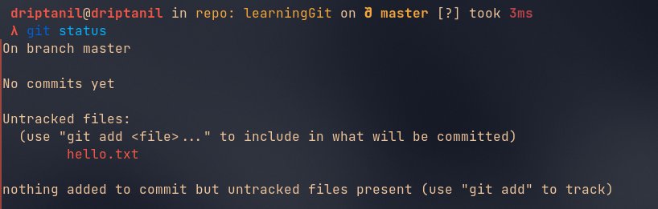
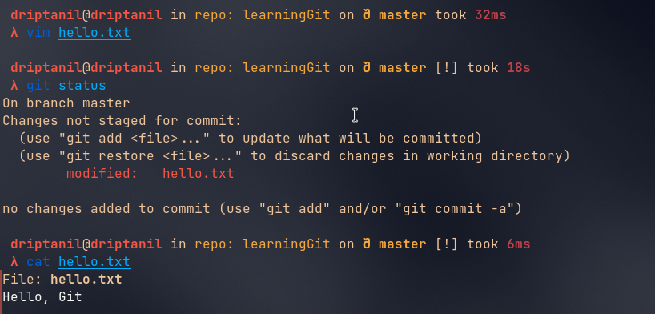

# Git Basics
- __Version control__ is a system that records changes to a file or set of files over time so that you can recall specific versions later.
- A __Repository__ contains all of your project's files and each file's revision history.

### 3 States
##### Modified
- changes are made in a file but have not been committed.

##### Staged
- a modified file is marked and is ready to get committed

##### Committed
- a snapshot of the data is permanently stored in git directory.

### Creating new Git Repository
- `git init` initialises an empty git repository in the current directory. A “.git” file is created and hidden.

    
- `ls -a` shows all the files including the hidden files.

- `touch hello.text` will create a file named “hello.txt”.

### Git Status
- `git status` shows the status of the git repository.

### Git Add
- `git add <file>` stages the changes of the file.

### Git Commit
- `git commit -m "<commit_message>"` commits to all the staged changes. “-m” adds name to the commit.

### Git Log
- `git log` will show all the history of all commits.

### Git Restore
- `vim names.txt` allows editing the file in the console, when files are modified after they are needed to be staged again.

- `git restore --staged <staged_file>` will remove staged changes for file from staged (only works after first commit).

### Git Reset
- `git reset <commit_id>` will revert to the commit.

### Git Stash
- `git stash` will neither commit the changes nor will delete all the changes, it just stores the changes somewhere else.

- `git stash pop` will bring back all the changes stored somewhere else and will be staged.

- `git stash clear` will remove all the changes that haven’t been staged or committed will be removed. 

### Adding Origin
- `git remote add origin https://github.com/<username>/<repository_link>` will link the working directory to the GitHub repository. 

### Git Push
- `git push <repository-link>` or `git push origin` will push all the commits made in local git directory to remote repository. __Does not work, now token are used for authentication of user.__ [GitHub Personal Access Token Documentation](https://docs.github.com/en/authentication/keeping-your-account-and-data-secure/creating-a-personal-access-token)

##### [GitHub Personal Access Token](https://github.com/settings/tokens):

- Click on `Generate new token`
- Choose the permissions and validity of the token
- Copy the token (Store it somewhere safe)

- `git push https://<token>@github.com/<username>/<repository_link>` will push all the commits to the repository.

##### SSH Keys:
1. Use `git clone git@github.com:<user>/<repository>.git` to clone repository. 
2. Use `ssh-keygen -o` to generate SSH key using git. 
3. Use `cat ~/.ssh/id_rsa.pub` (this file contains the private SSH key) and select the contents and copy using `Ctrl + Shift + C`. 
4. Open `https://github.com/settings/keys` (adding the private SSH key to GitHub), click on `new SSH keys`.  Paste the copied key in `key` section and add a `title`.  
5. Click on `Add SSH key`.

### Pulling Changes
- `git pull origin` will pull all the commits made in the remote repository to the local git directory.

### Cloning Repository
- `git clone <repository_link>` will download all the files in the remote repository to a local git directory.

## How to make contributions to the existing GitHub repository?

### Forking a Repository
- No one except the owner of the GitHub repository is allowed to make changes directly to the repository.
- `Fork` allows us to make a copy of the existing GitHub repository with our own ownership and in this repository, we are allowed to make changes directly.
- The original repository which has been forked is known as the Upstream URL.
  