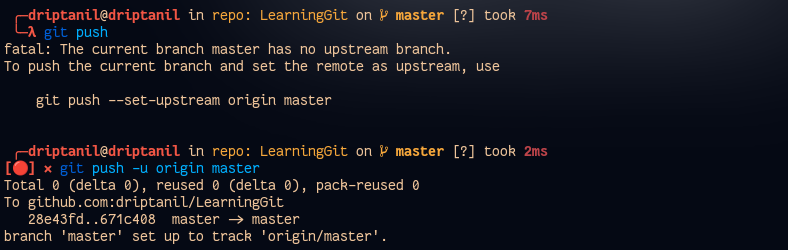

# Git Branches
What is the use of __Branches__?

- When adding a feature or repairing a bug then always create a new branch.
- Never commit directly commit to the “main” or “master” branch which is the default branch of a GitHub Repository. Because in Open-Source Projects, code in “main” is used by everyone, and maybe our code may have some errors and is not finalised yet.

### Head Branch
- It is the active and the checked out branch, commits are always made in Head Branch
- By default “HEAD” points to the “main” or “master” branch. Generally, commits are made on the “HEAD” inside the “.git” folder.

### Local Branches
- The branches present in the local machine.

### Remote Branches
- The branches present in remote location.

### Creating new Branch
- `git branch <branch_name>` creates a new local branch.

- `git branch <branch_name> <revision_id>` creates a new local branch at the commit with revision_id
  
  

### Switching Branches
- `git checkout <branch>` or `git switch <branch>` is used to change “HEAD” which will now point to the branch.

- Now commits are made to the checked out branch and the “main” or “master” branch remains unchanged.

### Renaming Branches
##### Local Branches
- `git branch -m <new_branch>` will rename the current head branch.
  
- `git branch -m <branch> <new_branch>` will rename the branch.
  

##### Remote Branches
### Git Merge
- `git merge <branch>` is used to update and merge all the changes made in the “feature” branch to the “main” or “master” branch.

### Publishing Branches
- `git push -u origin <branch>` will push the local branch to remote.
  (`-u` helps establish a tracking connection)
  
  
##### Tracking Connection
- By default, branches in git have no relation with each other. 
- A Tracking Connection is allows local branch to track remote branch 
- It allows `git push` & `git pull` in place of `git push origin <branch>` 
- Git also informs about unpushed or unpulled files.

- -> `git branch --track <local_branch><remote_branch>`

- `git push origin master` will push all the commits to the “master” branch of GitHub Repository. 

- How to make contributions to the existing GitHub repository?

- No one except the owner of the GitHub repository is allowed to make changes directly to the repository.

- `Fork` allows us to make a copy of the existing GitHub repository with our own ownership and in this repository, we are allowed to make changes directly.

- `git clone https://github.com/driptanil/DSA-Bootcamp-Java` allows us to download all the source files of the forked repository.

- The original repository which has been forked is known as the Upstream URL.
  