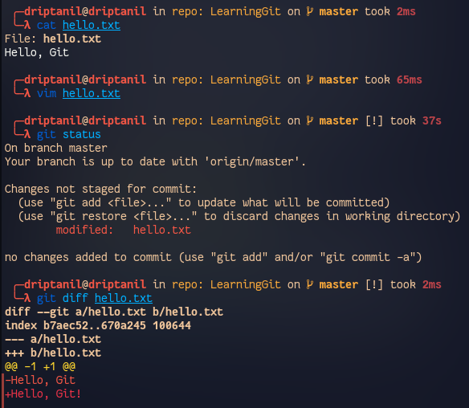
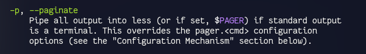

# Git for Professionals

### Perfect Git Commit

- File staging helps in better commits, (easier to manage, review code and adding commit messages).
- Use `git diff <file>`, to view the changes made to the not staged file. 
- Use `git -p` to stage certain chucks of changes in a file. 
- 
	- `y` -> stage hunk
	- `n` -> do not stage hunk
	- `a` -> stage all remaining hunks
	- `d` -> do not stage any remaining hunks
	- `s` -> split the current hunk
	- `e` -> manually edit the current hunk

- Use `git commit` to open a text editor (default: vi editor, or use `git config --global core.editor <editor_name>`)

- Format for commit message: 

	1. 1st line: Subject
	2. 2nd line: ``<blank>
	3. 3rd line: Body
	   a. What is now different than before?
	   b. What is the reason for the change?
	   c. Is there anything to watch out for / anything particularly remarkable 

#### Branching Strategies

##### Convention:
 (agree on a Branching Work-flow in a team)

1. Git allows users to create branches - learning it for better usage would improve the work-flow
2. A written best practice / strategy to ideally structure work in between team members
3. Team members, team size and type of project plays a huge role in managing project releases.
4. Helping new on-board team members to understand the work-flow to reduce conflicts

##### Integrating Changes & Structuring Releases

###### Mainline Development
(always be integrating)

-> few branches
-> relatively small commit
-> high-quality testing & QA standards

###### State, Release, and Feature Branches
(Branches Enhance Structures & Workflows)

-> different types of branches
-> fulfil different types of jobs
