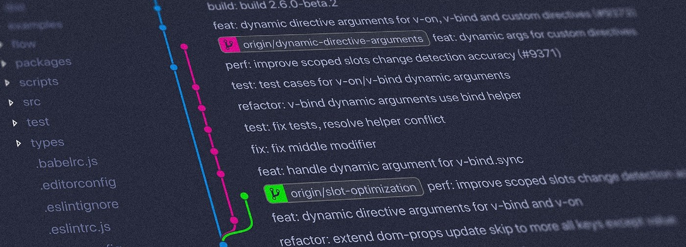

 
#  Git & GitHub  

<h2>⠀My Gratitude to   <a href="https://github.com/freecodecamp">@freecodecamp</a></h2>
 

<h2>
	⠀Tools  I use :
</h2>
    

        
        <a href="https://www.gitkraken.com/">   Git Kraken</a>
        
        <a href="https://obsidian.md/"> Obsidian</a>
    

 
<h2>⠀Progress: </h2>

<table>
	<thead align="center">
		<tr border: none;>
			<td>📚 Topics</td>
			<td>🏗️ Progress</td>
			<td>📽️ Video Links</td>
		</tr>
	</thead>
	<tbody>
		<tr>
			<td><a href="https://github.com/driptanil/Git-GitHub/tree/main/Git-Basics">Git Basics</a></td>
			<td> </td>
			<td><a href="https://youtu.be/RGOj5yH7evk">Git and GitHub for Beginners - Crash Course</a></td>
		</tr>
		<tr>
			<td><a href="https://github.com/driptanil/Git-GitHub/tree/main/Git-Branches">Git Branches</a></td>
			<td> </td>
			<td><a href="https://youtu.be/e2IbNHi4uCI">Git Branches Tutorial</a></td>
		</tr>
		<tr>
			<td><a href="https://github.com/driptanil/Git-GitHub/tree/main/Git-for-Professionals">Git for Professionals</a></td>
			<td> </td>
			<td><a href="https://youtu.be/Uszj_k0DGsg">Git for Professionals Tutorial - Tools & Concepts for Mastering Version Control with Git</a></td>
		</tr>
		<tr>
			<td><a href="https://github.com/driptanil/Git-GitHub/tree/main/Git-Advanced">Git for Professionals</a></td>
			<td> </td>
			<td><a href="https://youtu.be/qsTthZi23VE">Git for Professionals Tutorial - Tools & Concepts for Mastering Version Control with Git</a></td>
		</tr>
	</tbody>
</table>
