 
#  Git & GitHub  
- `git init` initialises an empty git repository in the current directory. A “.git” file is created and hidden.
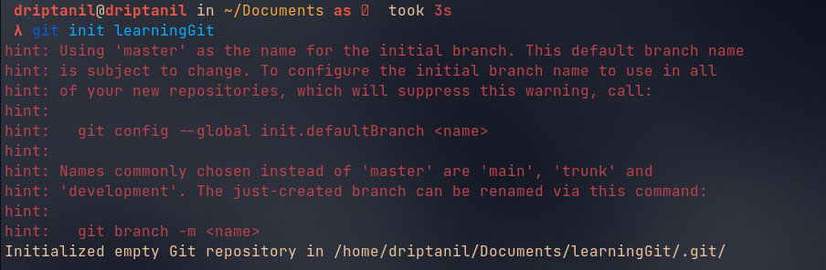
    
- `ls -a` shows all the files including the hidden files.
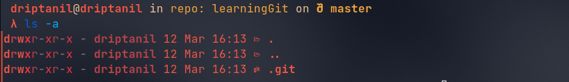

- `touch hello.text` will create a file named “hello.txt”.
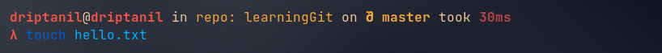
- `git status` shows the status of the git repository.
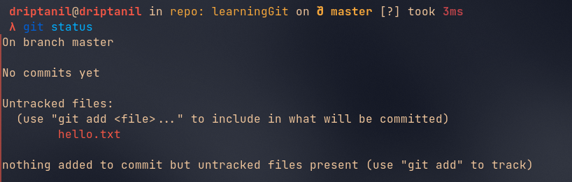

- `git add names.txt` stages the changes of the “hello.txt” file, then `git status` shows “Changes to be committed: hello.txt”. 
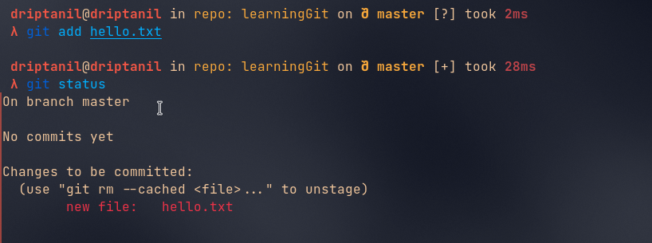
    
- `git commit -m "names.txt file added"` commits to all the staged changes. “-m” adds name to the commit.
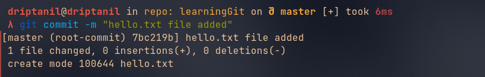
- `git log` will show all the history of all commits.
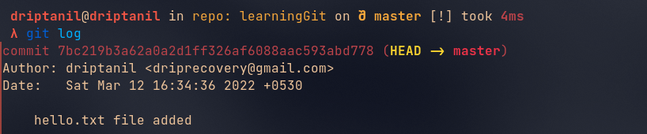
- `vi names.txt` allows editing the file in the console, when files are modified after they are needed to be staged again.
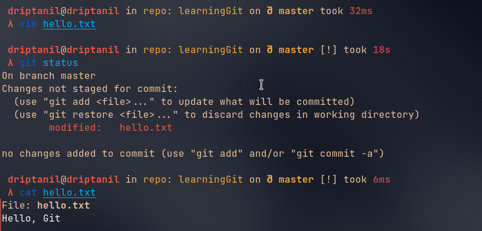
- `git restore --staged names.txt` will remove “names.txt” from staged (only works after first commit).

- `git reset <commit_id>` will revert to the commit.
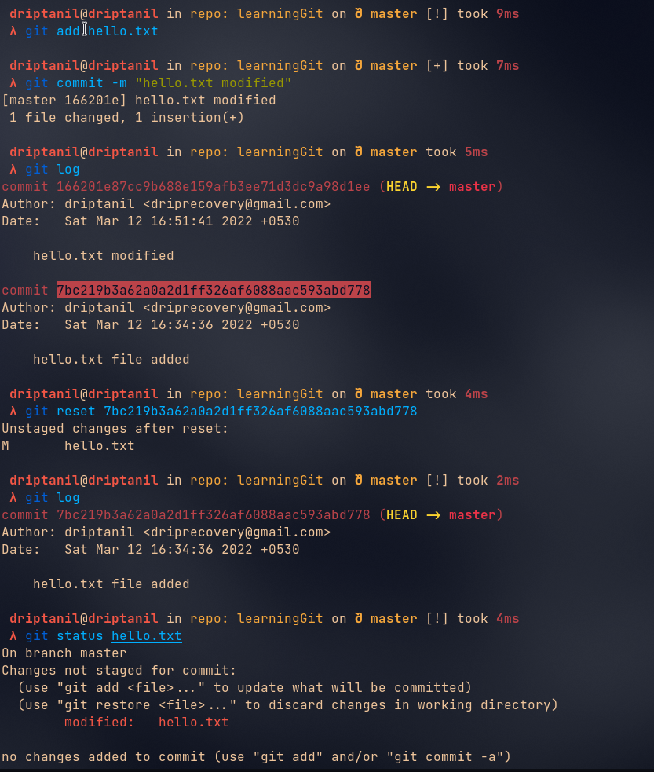
- `git stash` will neither commit the changes nor will delete all the changes, it just stores the changes somewhere else.
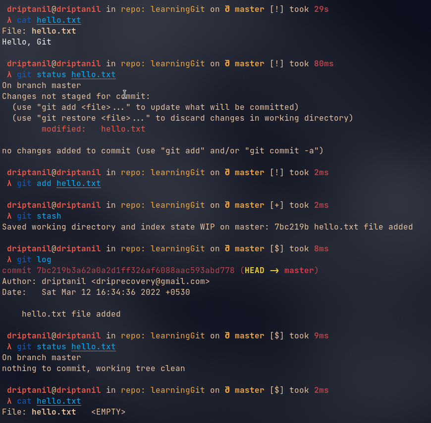
- `git stash pop` will bring back all the changes stored somewhere else and will be staged.
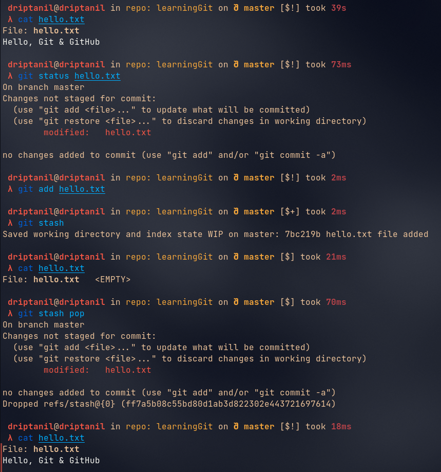
- `git stash clear` will remove all the changes that haven’t been staged or committed will be removed. 
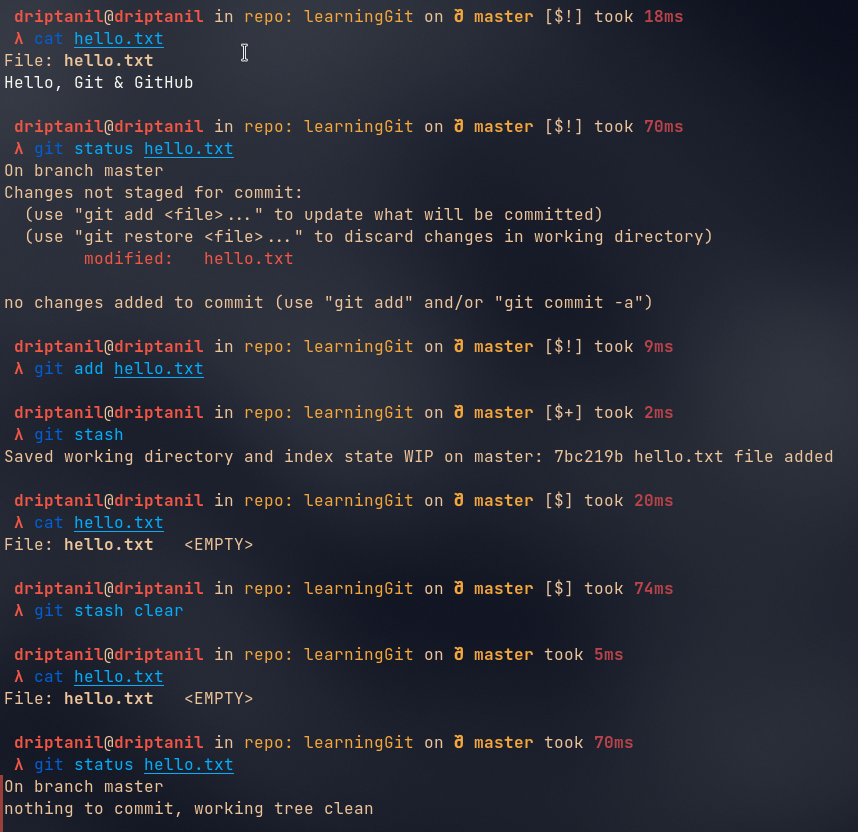

- A __Repository__ contains all of your project's files and each file's revision history.

- `git push <repository-link>` will push all the commits to the “main” branch of the GitHub Repository. __Does not work, now token are used for authentication of user.__ [GitHub Personal Access Token Documentation](https://docs.github.com/en/authentication/keeping-your-account-and-data-secure/creating-a-personal-access-token)
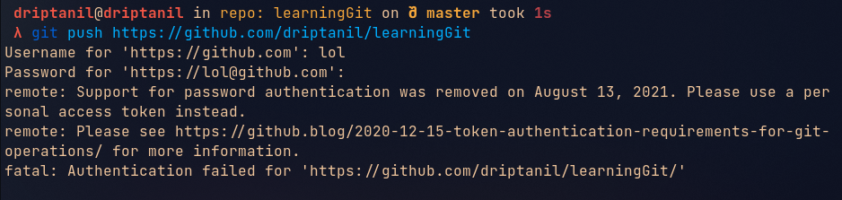
- [GitHub Personal Access Token](https://github.com/settings/tokens):
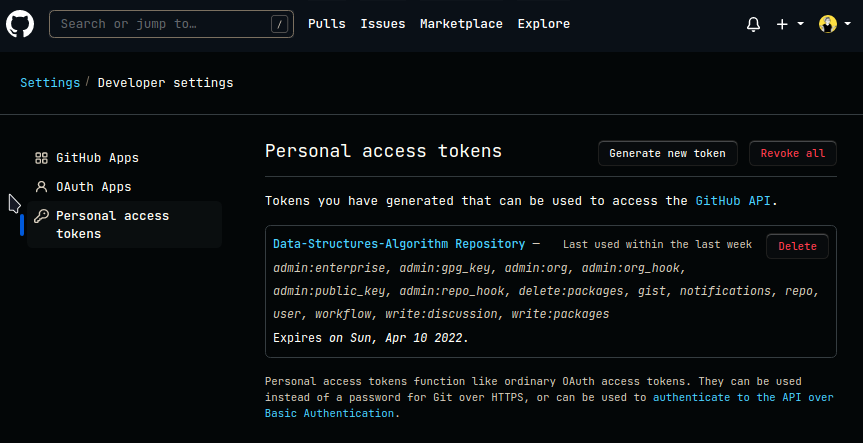
- Click on `Generate new token`
- Choose the permissions and validity of the token
- Copy the token (Store it somewhere safe)

- `git push https://<token>@github.com/<username>/<repository_link>` will push all the commits to the repository.
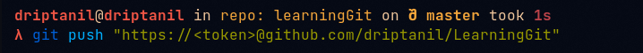
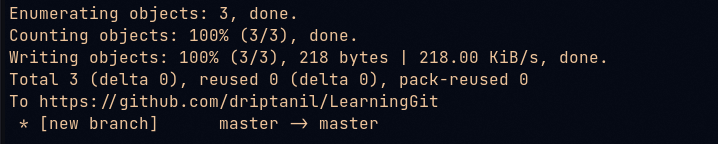
- What is the use of __Branches__?

- When adding a feature or repairing a bug then always create a new branch.
- Never commit directly commit to the “main” or “master” branch which is the default branch of a GitHub Repository. Because in Open-Source Projects, code in “main” is used by everyone, and maybe our code may have some errors and is not finalised yet.

- `git remote add origin https://<token>@github.com/<username>/<repository_link>` will link the working directory to the GitHub repository.

- `git branch feature` creates a new branch named “feature”
- By default “HEAD” points to the “main” or “master” branch. Generally, commits are made on the “HEAD” inside the “.git” folder.
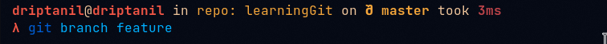
- `git checkout feature` is used to change “HEAD” which will now point to the “feature” branch.

- Now commits are made to the “feature” branch and the “main” or “master” branch remains unchanged.
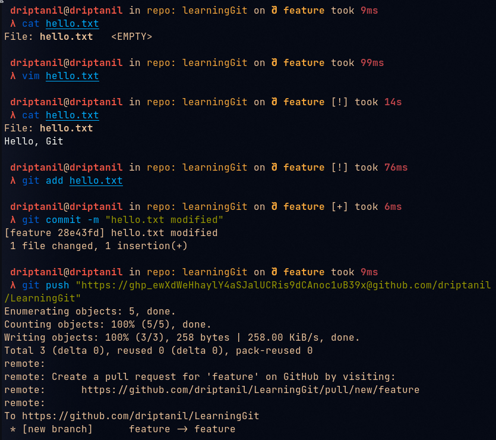

- `git merge feature` is used to update and merge all the changes made in the “feature” branch to the “main” or “master” branch.
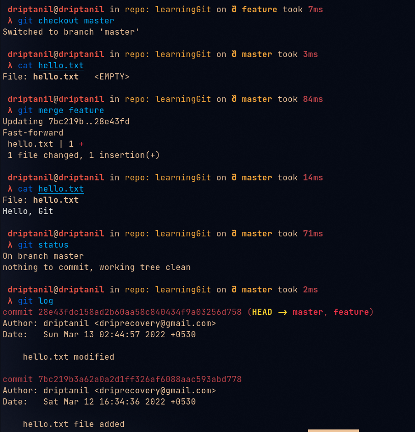
- `git push origin master` will push all the commits to the “master” branch of GitHub Repository.
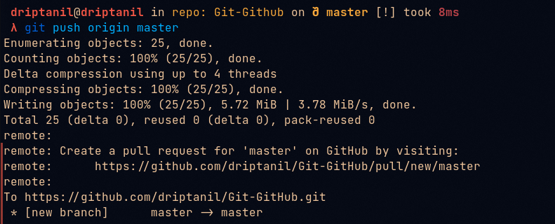
- How to make contributions to the existing GitHub repository?

- No one except the owner of the GitHub repository is allowed to make changes directly to the repository.

- `Fork` allows us to make a copy of the existing GitHub repository with our own ownership and in this repository, we are allowed to make changes directly.
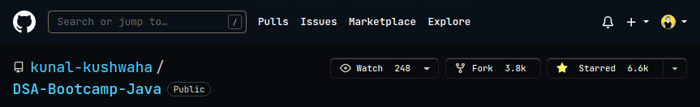
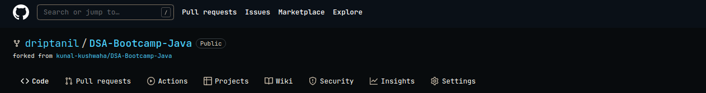
- `git clone https://github.com/driptanil/DSA-Bootcamp-Java` allows us to download all the source files of the forked repository.
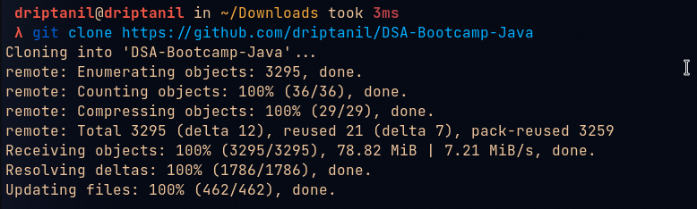
- The original repository which has been forked is known as the Upstream URL.
  `git remote add origin https://<token>@github.com/driptanil/DSA-Bootcamp-Java.git` adds Upstream URL.
  
- How to merge all the changes made in the forked repository to the original repository?
    - “Pull request” is a request to pull all the changes made in the forked repository to Upstream Repository,
        
        
        
        
        
        
        
- Why never commit to the “main” or “master” branch of a GitHub Repository?
    - For Example Someone wants to add 10 features, as each branch only allows only pull requests. So all the features will be added to one pull request. If the owner likes a feature out of 10 features. Then, the owner will not get an option to merge that one feature (which he likes) and it will also be hard to manage.
    - This is why when adding new features always create new branches → new pull requests.
        
        
        
        
        
    - after committing and pushing all the new changes made to the pull request branch, it automatically updates the pull requests.
        
        
        
- How to remove commits made to the pull request branch?
    
    
    
    - Use `git reset commitID`
        
        
        
        
        
    - Still, after `git reset` the pull request contains the previously committed changes.
        
        
        
    - To remove this, `git push origin kunal -f` ”-f” is used to make a forced push, as commits are inter-linked.
        
        
        
        
        
- To merge the pull request, click on `merge pull request`
    
    
    
    
    
    This will merge all changes made in the “kunal” branch of the forked repository to the Upstream repository.
    

### Conflicts

- But the changes made to the “kunal” in the forked repository will not show in default, as ‘kunal” branch is not the default branch which is the “main” branch.
There are 2 ways to update the forked repository:
    
    
    
    - To fetch the updates made in the Upstream repository, click on `fetch upstream`.
        
        
        
        - To fetch all the changes made upstream, use `git reset --hard upstream`, “--hard” is a confirmation. So, use it with caution.
            
            
            
    - First, `git checkout main` to point the HEAD to the ‘main” branch.
        
        
        
        - The ”main” branch has only one commit
            
            
            
        - `git fetch --all --prune`  “--all” will fetch the commits made in all the branches. “--prune” will also fetch the commits made in deleted branches.
- Finally after fetch, use `git push origin main`
    
    
    
- If anyone commits to Upstream Repository, to download the changes locally to the forked repository use `git pull upstream main.`
    
    
    
    
    
    - Now use `git push origin main` to save the changes made locally to the forked repository.
        
        
        
        
        
- `git branch temp` will create a new branch “temp” from the “main” branch.
    
    
    
    - If too many commits are made to “temp” branch
        
        
        
    - `git rebase -i 4f3b54bf569c9c7ed40c8c90e1c72d5e8ac46253` allows us to edit all the commits.
        
        
        
        Squash merges the commits to the commit made before it.
        
        
        
        After typing `:x` and pressing Enter, we will be able to edit the commit message.
        
        
        
        
        
        Again typing `:x` will exit.
        
        
        
- What are merge conflicts?
    
    
    
    
    
    - After both Kunal’s change and Rahul’s changes have been merged. There will be a conflict while pushing the commits to the GitHub repository.
        
        
        
    - To resolve this conflict, we will have to do it manually.
        
        
        
        
        
        